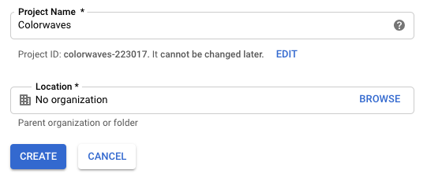
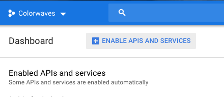
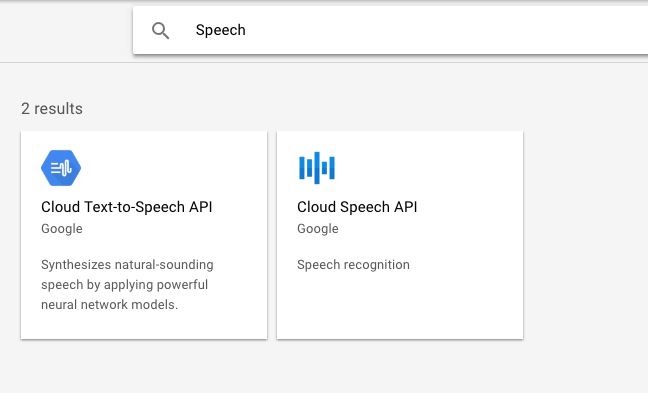
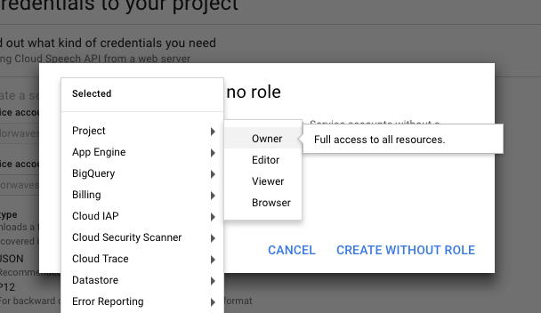
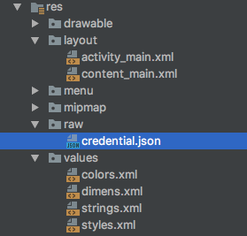
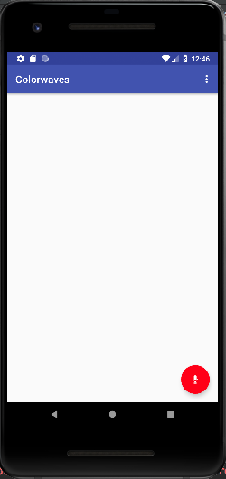
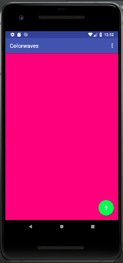

author:            Kit, Jacob, Madeline
summary:           Colorwaves topic survey project
id:                1005
environments:      android

#Topic Survey: Voice Recognition and Colorwaves

###### Team 1005: Jacob, Madeline, and Kit


## Overview of Tutorial

We're going to make an app called "Colorwaves". It well let you control the color of your screen purely from your voice.

Prerequisites:

* Android Studio 3.2
* Android physical or virtual devices API 27
* Google Cloud


## Starter Code

If you do not have the starter code android files, please follow the steps to make the base application. If you have the code, import it as a project in Android Studio and feel free to move to the next section.

1. Make a new project called Colorwaves
2. Select Basic Activity
3. Make a class called **GoogleCredentialsInterceptor** using the code below:


```java
import com.google.auth.Credentials;

import java.io.IOException;
import java.net.URI;
import java.net.URISyntaxException;
import java.util.List;
import java.util.Map;

import io.grpc.CallOptions;
import io.grpc.Channel;
import io.grpc.ClientCall;
import io.grpc.ClientInterceptor;
import io.grpc.ClientInterceptors;
import io.grpc.Metadata;
import io.grpc.MethodDescriptor;
import io.grpc.Status;
import io.grpc.StatusException;

/**
 * Created by brijesh on 22/7/17.
 */

public class GoogleCredentialsInterceptor implements ClientInterceptor {

    private final Credentials mCredentials;

    private Metadata mCached;

    private Map<String, List<String>> mLastMetadata;

    GoogleCredentialsInterceptor(Credentials credentials) {
        mCredentials = credentials;
    }

    @Override
    public <ReqT, RespT> ClientCall<ReqT, RespT> interceptCall(final MethodDescriptor<ReqT, RespT> method, CallOptions callOptions, final Channel next) {
        return new ClientInterceptors.CheckedForwardingClientCall<ReqT, RespT>(
                next.newCall(method, callOptions)) {
            @Override
            protected void checkedStart(Listener<RespT> responseListener, Metadata headers)
                    throws StatusException {
                Metadata cachedSaved;
                URI uri = serviceUri(next, method);
                synchronized (this) {
                    Map<String, List<String>> latestMetadata = getRequestMetadata(uri);
                    if (mLastMetadata == null || mLastMetadata != latestMetadata) {
                        mLastMetadata = latestMetadata;
                        mCached = toHeaders(mLastMetadata);
                    }
                    cachedSaved = mCached;
                }
                headers.merge(cachedSaved);
                delegate().start(responseListener, headers);
            }
        };
    }

    /**
     * Generate a JWT-specific service URI. The URI is simply an identifier with enough
     * information for a service to know that the JWT was intended for it. The URI will
     * commonly be verified with a simple string equality check.
     */
    private URI serviceUri(Channel channel, MethodDescriptor<?, ?> method)
            throws StatusException {
        String authority = channel.authority();
        if (authority == null) {
            throw Status.UNAUTHENTICATED
                    .withDescription("Channel has no authority")
                    .asException();
        }
        // Always use HTTPS, by definition.
        final String scheme = "https";
        final int defaultPort = 443;
        String path = "/" + MethodDescriptor.extractFullServiceName(method.getFullMethodName());
        URI uri;
        try {
            uri = new URI(scheme, authority, path, null, null);
        } catch (URISyntaxException e) {
            throw Status.UNAUTHENTICATED
                    .withDescription("Unable to construct service URI for auth")
                    .withCause(e).asException();
        }
        // The default port must not be present. Alternative ports should be present.
        if (uri.getPort() == defaultPort) {
            uri = removePort(uri);
        }
        return uri;
    }

    private URI removePort(URI uri) throws StatusException {
        try {
            return new URI(uri.getScheme(), uri.getUserInfo(), uri.getHost(), -1 /* port */,
                    uri.getPath(), uri.getQuery(), uri.getFragment());
        } catch (URISyntaxException e) {
            throw Status.UNAUTHENTICATED
                    .withDescription("Unable to construct service URI after removing port")
                    .withCause(e).asException();
        }
    }

    private Map<String, List<String>> getRequestMetadata(URI uri) throws StatusException {
        try {
            return mCredentials.getRequestMetadata(uri);
        } catch (IOException e) {
            throw Status.UNAUTHENTICATED.withCause(e).asException();
        }
    }

    private static Metadata toHeaders(Map<String, List<String>> metadata) {
        Metadata headers = new Metadata();
        if (metadata != null) {
            for (String key : metadata.keySet()) {
                Metadata.Key<String> headerKey = Metadata.Key.of(
                        key, Metadata.ASCII_STRING_MARSHALLER);
                for (String value : metadata.get(key)) {
                    headers.put(headerKey, value);
                }
            }
        }
        return headers;
    }

}
```

4. Make a class called **VoiceRecorder**

```java
/*
 * Copyright 2016 Google Inc. All Rights Reserved.
 *
 * Licensed under the Apache License, Version 2.0 (the "License");
 * you may not use this file except in compliance with the License.
 * You may obtain a copy of the License at
 *
 * http://www.apache.org/licenses/LICENSE-2.0
 *
 * Unless required by applicable law or agreed to in writing, software
 * distributed under the License is distributed on an "AS IS" BASIS,
 * WITHOUT WARRANTIES OR CONDITIONS OF ANY KIND, either express or implied.
 * See the License for the specific language governing permissions and
 * limitations under the License.
 */

package com.app.androidkt.speechapi;

import android.media.AudioFormat;
import android.media.AudioRecord;
import android.media.MediaRecorder;
import android.support.annotation.NonNull;


/**
 * Continuously records audio and notifies the {@link VoiceRecorder.Callback} when voice (or any
 * sound) is heard.
 *
 * <p>The recorded audio format is always {@link AudioFormat#ENCODING_PCM_16BIT} and
 * {@link AudioFormat#CHANNEL_IN_MONO}. This class will automatically pick the right sample rate
 * for the device. Use {@link #getSampleRate()} to get the selected value.</p>
 */
public class VoiceRecorder {

    private static final int[] SAMPLE_RATE_CANDIDATES = new int[]{16000, 11025, 22050, 44100};

    private static final int CHANNEL = AudioFormat.CHANNEL_IN_MONO;
    private static final int ENCODING = AudioFormat.ENCODING_PCM_16BIT;

    private static final int AMPLITUDE_THRESHOLD = 1500;

    private static final int SPEECH_TIMEOUT_MILLIS = 2000;
    private static final int MAX_SPEECH_LENGTH_MILLIS = 30 * 1000;

    public static abstract class Callback {

        /**
         * Called when the recorder starts hearing voice.
         */
        public void onVoiceStart() {
        }

        /**
         * Called when the recorder is hearing voice.
         *
         * @param data The audio data in {@link AudioFormat#ENCODING_PCM_16BIT}.
         * @param size The size of the actual data in {@code data}.
         */
        public void onVoice(byte[] data, int size) {
        }

        /**
         * Called when the recorder stops hearing voice.
         */
        public void onVoiceEnd() {
        }
    }

    private final Callback mCallback;

    private AudioRecord mAudioRecord;

    private Thread mThread;

    private byte[] mBuffer;

    private final Object mLock = new Object();

    /** The timestamp of the last time that voice is heard. */
    private long mLastVoiceHeardMillis = Long.MAX_VALUE;

    /** The timestamp when the current voice is started. */
    private long mVoiceStartedMillis;

    public VoiceRecorder(@NonNull Callback callback) {
        mCallback = callback;
    }

    /**
     * Starts recording audio.
     *
     * <p>The caller is responsible for calling {@link #stop()} later.</p>
     */
    public void start() {
        // Stop recording if it is currently ongoing.
        stop();
        // Try to create a new recording session.
        mAudioRecord = createAudioRecord();
        if (mAudioRecord == null) {
            throw new RuntimeException("Cannot instantiate VoiceRecorder");
        }
        // Start recording.
        mAudioRecord.startRecording();
        // Start processing the captured audio.
        mThread = new Thread(new ProcessVoice());
        mThread.start();
    }

    /**
     * Stops recording audio.
     */
    public void stop() {
        synchronized (mLock) {
            dismiss();
            if (mThread != null) {
                mThread.interrupt();
                mThread = null;
            }
            if (mAudioRecord != null) {
                mAudioRecord.stop();
                mAudioRecord.release();
                mAudioRecord = null;
            }
            mBuffer = null;
        }
    }

    /**
     * Dismisses the currently ongoing utterance.
     */
    public void dismiss() {
        if (mLastVoiceHeardMillis != Long.MAX_VALUE) {
            mLastVoiceHeardMillis = Long.MAX_VALUE;
            mCallback.onVoiceEnd();
        }
    }

    /**
     * Retrieves the sample rate currently used to record audio.
     *
     * @return The sample rate of recorded audio.
     */
    public int getSampleRate() {
        if (mAudioRecord != null) {
            return mAudioRecord.getSampleRate();
        }
        return 0;
    }

    /**
     * Creates a new {@link AudioRecord}.
     *
     * @return A newly created {@link AudioRecord}, or null if it cannot be created (missing
     * permissions?).
     */
    private AudioRecord createAudioRecord() {
        for (int sampleRate : SAMPLE_RATE_CANDIDATES) {
            final int sizeInBytes = AudioRecord.getMinBufferSize(sampleRate, CHANNEL, ENCODING);
            if (sizeInBytes == AudioRecord.ERROR_BAD_VALUE) {
                continue;
            }
            final AudioRecord audioRecord = new AudioRecord(MediaRecorder.AudioSource.MIC,
                    sampleRate, CHANNEL, ENCODING, sizeInBytes);
            if (audioRecord.getState() == AudioRecord.STATE_INITIALIZED) {
                mBuffer = new byte[sizeInBytes];
                return audioRecord;
            } else {
                audioRecord.release();
            }
        }
        return null;
    }

    /**
     * Continuously processes the captured audio and notifies {@link #mCallback} of corresponding
     * events.
     */
    private class ProcessVoice implements Runnable {

        @Override
        public void run() {
            while (true) {
                synchronized (mLock) {
                    if (Thread.currentThread().isInterrupted()) {
                        break;
                    }
                    final int size = mAudioRecord.read(mBuffer, 0, mBuffer.length);
                    final long now = System.currentTimeMillis();
                    if (isHearingVoice(mBuffer, size)) {
                        if (mLastVoiceHeardMillis == Long.MAX_VALUE) {
                            mVoiceStartedMillis = now;
                            mCallback.onVoiceStart();
                        }
                        mCallback.onVoice(mBuffer, size);
                        mLastVoiceHeardMillis = now;
                        if (now - mVoiceStartedMillis > MAX_SPEECH_LENGTH_MILLIS) {
                            end();
                        }
                    } else if (mLastVoiceHeardMillis != Long.MAX_VALUE) {
                        mCallback.onVoice(mBuffer, size);
                        if (now - mLastVoiceHeardMillis > SPEECH_TIMEOUT_MILLIS) {
                            end();
                        }
                    }
                }
            }
        }

        private void end() {
            mLastVoiceHeardMillis = Long.MAX_VALUE;
            mCallback.onVoiceEnd();
        }

        private boolean isHearingVoice(byte[] buffer, int size) {
            for (int i = 0; i < size - 1; i += 2) {
                // The buffer has LINEAR16 in little endian.
                int s = buffer[i + 1];
                if (s < 0) s *= -1;
                s <<= 8;
                s += Math.abs(buffer[i]);
                if (s > AMPLITUDE_THRESHOLD) {
                    return true;
                }
            }
            return false;
        }
    }
}
```

5. Make a class called **SpeechAPI**. The code can be found below.

```java
import android.content.Context;
import android.content.SharedPreferences;
import android.os.AsyncTask;
import android.os.Handler;
import android.support.annotation.NonNull;
import android.util.Log;

import com.google.auth.oauth2.AccessToken;
import com.google.auth.oauth2.GoogleCredentials;
import com.google.cloud.speech.v1.RecognitionConfig;
import com.google.cloud.speech.v1.SpeechGrpc;
import com.google.cloud.speech.v1.SpeechRecognitionAlternative;
import com.google.cloud.speech.v1.StreamingRecognitionConfig;
import com.google.cloud.speech.v1.StreamingRecognitionResult;
import com.google.cloud.speech.v1.StreamingRecognizeRequest;
import com.google.cloud.speech.v1.StreamingRecognizeResponse;
import com.google.protobuf.ByteString;

import java.io.IOException;
import java.io.InputStream;
import java.util.ArrayList;
import java.util.Collections;
import java.util.Date;
import java.util.List;
import java.util.concurrent.TimeUnit;

import io.grpc.ManagedChannel;
import io.grpc.internal.DnsNameResolverProvider;
import io.grpc.okhttp.OkHttpChannelProvider;
import io.grpc.stub.StreamObserver;


public class SpeechAPI {

    public static final List<String> SCOPE = Collections.singletonList("https://www.googleapis.com/auth/cloud-platform");
    public static final String TAG = "SpeechAPI";

    private static final String PREFS = "SpeechService";
    private static final String PREF_ACCESS_TOKEN_VALUE = "access_token_value";
    private static final String PREF_ACCESS_TOKEN_EXPIRATION_TIME = "access_token_expiration_time";

    /**
     * We reuse an access token if its expiration time is longer than this.
     */
    private static final int ACCESS_TOKEN_EXPIRATION_TOLERANCE = 30 * 60 * 1000; // thirty minutes

    /**
     * We refresh the current access token before it expires.
     */
    private static final int ACCESS_TOKEN_FETCH_MARGIN = 60 * 1000; // one minute

    private static final String HOSTNAME = "speech.googleapis.com";
    private static final int PORT = 443;
    private static Handler mHandler;

    private final ArrayList<Listener> mListeners = new ArrayList<>();

    private final StreamObserver<StreamingRecognizeResponse> mResponseObserver = new StreamObserver<StreamingRecognizeResponse>() {
        @Override
        public void onNext(StreamingRecognizeResponse response) {
            String text = null;
            boolean isFinal = false;
            if (response.getResultsCount() > 0) {
                final StreamingRecognitionResult result = response.getResults(0);
                isFinal = result.getIsFinal();
                if (result.getAlternativesCount() > 0) {
                    final SpeechRecognitionAlternative alternative = result.getAlternatives(0);
                    text = alternative.getTranscript();
                }
            }
            if (text != null) {
                for (Listener listener : mListeners) {
                    listener.onSpeechRecognized(text, isFinal);
                }
            }
        }

        @Override
        public void onError(Throwable t) {
            Log.e(TAG, "Error calling the API.", t);
        }

        @Override
        public void onCompleted() {
            Log.i(TAG, "API completed.");
        }

    };
    private Context mContext;
    private volatile AccessTokenTask mAccessTokenTask;
    private final Runnable mFetchAccessTokenRunnable = new Runnable() {
        @Override
        public void run() {
            fetchAccessToken();
        }
    };
    private SpeechGrpc.SpeechStub mApi;
    private StreamObserver<StreamingRecognizeRequest> mRequestObserver;

    public SpeechAPI(Context mContext) {
        this.mContext = mContext;
        mHandler = new Handler();
        fetchAccessToken();

    }

    public void destroy() {
        mHandler.removeCallbacks(mFetchAccessTokenRunnable);
        mHandler = null;
        // Release the gRPC channel.
        if (mApi != null) {
            final ManagedChannel channel = (ManagedChannel) mApi.getChannel();
            if (channel != null && !channel.isShutdown()) {
                try {
                    channel.shutdown().awaitTermination(5, TimeUnit.SECONDS);
                } catch (InterruptedException e) {
                    Log.e(TAG, "Error shutting down the gRPC channel.", e);
                }
            }
            mApi = null;
        }
    }

    private void fetchAccessToken() {
        if (mAccessTokenTask != null) {
            return;
        }
        mAccessTokenTask = new AccessTokenTask();
        mAccessTokenTask.execute();
    }

    public void addListener(@NonNull Listener listener) {
        mListeners.add(listener);
    }

    public void removeListener(@NonNull Listener listener) {
        mListeners.remove(listener);
    }

    /**
     * Starts recognizing speech audio.
     *
     * @param sampleRate The sample rate of the audio.
     */
    public void startRecognizing(int sampleRate) {
        if (mApi == null) {
            Log.w(TAG, "API not ready. Ignoring the request.");
            return;
        }

        // Configure the API
        mRequestObserver = mApi.streamingRecognize(mResponseObserver);

        StreamingRecognitionConfig streamingConfig = StreamingRecognitionConfig.newBuilder()
                .setConfig(RecognitionConfig.newBuilder()
                        .setLanguageCode("en-US")
                        .setEncoding(RecognitionConfig.AudioEncoding.LINEAR16)
                        .setSampleRateHertz(sampleRate)
                        .build()
                )
                .setInterimResults(true)
                .setSingleUtterance(true)
                .build();

        StreamingRecognizeRequest streamingRecognizeRequest = StreamingRecognizeRequest.newBuilder().setStreamingConfig(streamingConfig).build();
        mRequestObserver.onNext(streamingRecognizeRequest);
    }

    /**
     * Recognizes the speech audio. This method should be called every time a chunk of byte buffer
     * is ready.
     *
     * @param data The audio data.
     * @param size The number of elements that are actually relevant in the {@code data}.
     */
    public void recognize(byte[] data, int size) {
        if (mRequestObserver == null) {
            return;
        }
        // Call the streaming recognition API
        mRequestObserver.onNext(StreamingRecognizeRequest.newBuilder()
                .setAudioContent(ByteString.copyFrom(data, 0, size))
                .build());
    }

    /**
     * Finishes recognizing speech audio.
     */
    public void finishRecognizing() {
        if (mRequestObserver == null) {
            return;
        }
        mRequestObserver.onCompleted();
        mRequestObserver = null;
    }

    public interface Listener {
        //Called when a new piece of text was recognized by the Speech API.
        void onSpeechRecognized(String text, boolean isFinal);
    }

    private class AccessTokenTask extends AsyncTask<Void, Void, AccessToken> {

        @Override
        protected AccessToken doInBackground(Void... voids) {

            final SharedPreferences prefs = mContext.getSharedPreferences(PREFS, Context.MODE_PRIVATE);
            String tokenValue = prefs.getString(PREF_ACCESS_TOKEN_VALUE, null);
            long expirationTime = prefs.getLong(PREF_ACCESS_TOKEN_EXPIRATION_TIME, -1);

            // Check if the current token is still valid for a while
            if (tokenValue != null && expirationTime > 0) {
                if (expirationTime > System.currentTimeMillis() + ACCESS_TOKEN_EXPIRATION_TOLERANCE) {
                    return new AccessToken(tokenValue, new Date(expirationTime));
                }
            }

            final InputStream stream = mContext.getResources().openRawResource(R.raw.credential);
            try {
                final GoogleCredentials credentials = GoogleCredentials.fromStream(stream).createScoped(SCOPE);
                final AccessToken token = credentials.refreshAccessToken();
                prefs.edit()
                        .putString(PREF_ACCESS_TOKEN_VALUE, token.getTokenValue())
                        .putLong(PREF_ACCESS_TOKEN_EXPIRATION_TIME, token.getExpirationTime().getTime())
                        .apply();
                return token;
            } catch (IOException e) {
                Log.e(TAG, "Failed to obtain access token.", e);
            }
            return null;
        }

        @Override
        protected void onPostExecute(AccessToken accessToken) {
            mAccessTokenTask = null;
            final ManagedChannel channel = new OkHttpChannelProvider()
                    .builderForAddress(HOSTNAME, PORT)
                    .nameResolverFactory(new DnsNameResolverProvider())
                    .intercept(new GoogleCredentialsInterceptor(new GoogleCredentials(accessToken)
                            .createScoped(SCOPE)))
                    .build();
            mApi = SpeechGrpc.newStub(channel);

            // Schedule access token refresh before it expires
            if (mHandler != null) {
                mHandler.postDelayed(mFetchAccessTokenRunnable,
                        Math.max(accessToken.getExpirationTime().getTime() - System.currentTimeMillis() - ACCESS_TOKEN_FETCH_MARGIN, ACCESS_TOKEN_EXPIRATION_TOLERANCE));
            }
        }
    }
}
```

6. Update the Project Gradle
```javascript
// Top-level build file where you can add configuration options common to all sub-projects/modules.

buildscript {
    repositories {
        jcenter()
        maven {
            url 'https://maven.google.com/'
            name 'Google'
        }
    }
    dependencies {
        classpath 'com.android.tools.build:gradle:2.3.3'
        classpath 'com.google.protobuf:protobuf-gradle-plugin:0.8.0'

        // NOTE: Do not place your application dependencies here; they belong
        // in the individual module build.gradle files
    }
}

allprojects {
    repositories {
        jcenter()
        maven {
            url 'https://maven.google.com/'
            name 'Google'
        }
    }
}

task clean(type: Delete) {
    delete rootProject.buildDir
}
```


7. Update the App Gradle

```javascript
apply plugin: 'com.android.application'
apply plugin: 'com.google.protobuf'

ext {
    grpcVersion = '1.4.0'
}
android {
    compileSdkVersion 26
    buildToolsVersion "26.0.0"
    defaultConfig {
        applicationId "[YOUR APPLICATION ID]"
        minSdkVersion 21
        targetSdkVersion 26
        versionCode 1
        versionName "1.0"
        testInstrumentationRunner "android.support.test.runner.AndroidJUnitRunner"

        multiDexEnabled  true
    }
    buildTypes {
        release {
            minifyEnabled false
            proguardFiles getDefaultProguardFile('proguard-android.txt'), 'proguard-rules.pro'
        }
    }
    configurations.all {
        resolutionStrategy.force 'com.google.code.findbugs:jsr305:3.0.2'

    }
}
protobuf {
    protoc {
        artifact = 'com.google.protobuf:protoc:3.3.0'
    }
    plugins {
        javalite {
            artifact = "com.google.protobuf:protoc-gen-javalite:3.0.0"
        }
        grpc {
            artifact = "io.grpc:protoc-gen-grpc-java:${grpcVersion}"
        }
    }
    generateProtoTasks {
        all().each { task ->
            task.plugins {
                javalite {}
                grpc {
                    // Options added to --grpc_out
                    option 'lite'
                }
            }
        }
    }
}


dependencies {
    compile fileTree(dir: 'libs', include: ['*.jar'])
    androidTestCompile('com.android.support.test.espresso:espresso-core:2.2.2', {
        exclude group: 'com.android.support', module: 'support-annotations'
    })
    compile 'com.android.support:appcompat-v7:26.1.0'
    compile 'com.android.support.constraint:constraint-layout:1.0.2'
    testCompile 'junit:junit:4.12'

    compile 'com.jakewharton:butterknife:8.7.0'
    annotationProcessor 'com.jakewharton:butterknife-compiler:8.7.0'

    compile 'com.android.support:design:26.1.0'


    // gRPC
    compile "io.grpc:grpc-okhttp:$grpcVersion"
    compile "io.grpc:grpc-protobuf-lite:$grpcVersion"
    compile "io.grpc:grpc-stub:$grpcVersion"
    compile 'javax.annotation:javax.annotation-api:1.2'
    protobuf 'com.google.protobuf:protobuf-java:3.3.1'

    compile group: 'com.google.api.grpc', name: 'grpc-google-cloud-speech-v1', version: '0.1.13'

    // OAuth2 for Google API
    compile('com.google.auth:google-auth-library-oauth2-http:0.7.0') {
        exclude module: 'httpclient'
    }

    compile 'com.android.support:multidex:1.0.0'
    compile 'com.android.support:design:26.+'

}

```

8. Add audio and internet permissions to the manifest
```xml
    <uses-permission android:name="android.permission.RECORD_AUDIO" />
    <uses-permission android:name="android.permission.INTERNET" />
``` 

9. Add colors.xml
[Download colors.xml Here](https://drive.google.com/uc?export=download&id=1ci5otM9UZwphZ-4EZfgiO4p9Wmmo5x6G)
    
## Google Speech API

We're going to need to set up our google cloud and retrieve an API key.

Go to the Google Cloud Platform [console](https://console.cloud.google.com).

1. Create a new Project


2. Enable API


3. Add Cloud Speech API


4. Create credentials


5. Assign role


Once you have done this it will generate and download a JSON file. Rename this file to credentials.json and then create 
a new directory in your project res file called raw and add the json file there.




## Adding Functionality

Now it's time to start adding the functionality to change the background color!

In the `content_main.xml`, let's give the constraint layout a name, so we can reference it using `layout = 
(ConstraintLayout) findViewById(R.id.layout);`. Create this reference in `MainActivity.java`. Also feel free to get rid 
of the "Hello World" text.

Now let's go into the `activity_main.xml` and change the icon of the Floating Action Button to a mic. Find srcCompat in 
the properties view and change it to `ic_btn_speak_now`. Let's change the backgroundTint of the FAB to red, and the tint to WHITE.





Now even though we have user-permission in our manifest, we should request audio on runtime. Let's add this to our `onCreate()` method.
        
```Java
if (ContextCompat.checkSelfPermission(this, Manifest.permission.RECORD_AUDIO) != PackageManager.PERMISSION_GRANTED) {
	ActivityCompat.requestPermissions(this, new String[]{Manifest.permission.RECORD_AUDIO}, RECORD_REQUEST_CODE);
}
```
Putting our request code as a constant at the top of our class.

`private static final int RECORD_REQUEST_CODE = 101;`


Next we're going to set up our VoiceRecorder: 

```Java
private final VoiceRecorder.Callback mVoiceCallback = new VoiceRecorder.Callback() {

        @Override
        public void onVoiceStart() {
            if (speechAPI != null) {
                speechAPI.startRecognizing(mVoiceRecorder.getSampleRate());
            }
        }

        @Override
        public void onVoice(byte[] data, int size) {
            if (speechAPI != null) {
                speechAPI.recognize(data, size);
            }
        }

        @Override
        public void onVoiceEnd() {
            if (speechAPI != null) {
                speechAPI.finishRecognizing();
            }
        }

    };
```

Next, let's set up our SpeechAPI:
```Java
    private final SpeechAPI.Listener mSpeechServiceListener =
            new SpeechAPI.Listener() {
                @Override
                public void onSpeechRecognized(final String text, final boolean isFinal) {
                    processText(text);
                    if (isFinal) {
                        mVoiceRecorder.dismiss();
                    }
                }
            };
```

Be sure to add fields for our SpeechAPI and VoiceRecorder objects:
```Java
SpeechAPI speechAPI = new SpeechAPI(this);
```
and
```Java
VoiceRecorder mVoiceRecorder = new VoiceRecorder(mVoiceCallback);
```

We need to process the text. So let's create that processText function that is called when you set up `speechAPI`.
Since each color in the colors.xml is all-caps and only letters, then we capitalize and remove all whitespace from the string. 
```java
    private void processText(final String text) {
        runOnUiThread(new Runnable() {
            @Override
            public void run() {
                String newText = text.replaceAll("\\s+","");
                layout.setBackgroundResource(getColorByName(newText.toUpperCase()));
            }
        });
    }
```    
    
Now we need to get the color by name from our colors.xml resource file. We use reflection to accomplish this, by accessing a field by its name as a string. 
```java
    public int getColorByName(String name) {
        int colorId = 0;
        try {
            Class res = R.color.class;
            Field field = res.getField(name);
            colorId = field.getInt(null);
        } catch (Exception e) {
            //e.printStackTrace();
        }
        return colorId;
    }
```    
Now let's override on stop.
```java
    @Override
    protected void onStop() {
        stopVoiceRecorder();

        // Stop Cloud Speech API
        speechAPI.removeListener(mSpeechServiceListener);
        speechAPI.destroy();
        speechAPI = null;

        super.onStop();
    }
```    
    
We'll have these functions `startVoiceRecorder()` and `stopVoiceRecorder()`.

```java    
        private void startVoiceRecorder() {
        if (mVoiceRecorder != null) {
            mVoiceRecorder.stop();
        }
        mVoiceRecorder = new VoiceRecorder(mVoiceCallback);
        mVoiceRecorder.start();
    }

    private void stopVoiceRecorder() {
        if (mVoiceRecorder != null) {
            mVoiceRecorder.stop();
            mVoiceRecorder = null;
        }
    }
```    

It's finally time to put all these together. We're going to call these functions when our floating action button is pressed, and then stop when it's pressed again.

Let's create a public variable `boolean flag = true;` so we know if the button has been pressed our not.

Now we can get rid of the auto-generated snackbar in our FAB listener code and instead have:

```java
            public void onClick(View view) {
                if (flag){
                    ViewCompat.setBackgroundTintList(fab, ColorStateList.valueOf(Color.parseColor("GREEN")));
                    flag = false;
                    startVoiceRecorder();
                    speechAPI.addListener(mSpeechServiceListener);
                } else {
                    ViewCompat.setBackgroundTintList(fab, ColorStateList.valueOf(Color.parseColor("RED")));
                    flag = true;
                    speechAPI.removeListener(mSpeechServiceListener);
                    stopVoiceRecorder();
                }
            }
```


Now we're ready to run it! When we click the floating action button, it should turn green and we can speak the colors.



## Summary and Resources
In this tutorial we created the Colorwaves app that uses Google Cloud Speech API to change the color of our background to whatever color the user has spoken.

To learn more about the Google Speech API, please visit this [page](https://cloud.google.com/speech-to-text/).

